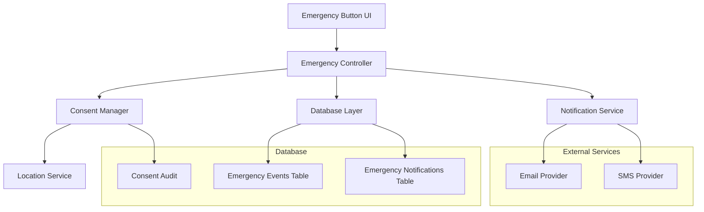

# Design Document

## Overview

The Emergency Escalation system provides real, honest emergency notification capabilities for NeuralTrace patients. When a patient triggers an emergency alert, the system attempts to notify real emergency contacts via email or SMS, with complete transparency about success or failure. The system prioritizes medical safety by never simulating emergency responses and always providing honest feedback about notification delivery.

## Architecture

The Emergency Escalation system follows a layered architecture with clear separation of concerns:



## Components and Interfaces

### Emergency Controller
**Purpose**: Orchestrates the entire emergency escalation process
**Responsibilities**:
- Validates patient authentication and authorization
- Coordinates consent collection, database operations, and notifications
- Ensures proper error handling and state management
- Maintains audit trail throughout the process

**Interface**:
```typescript
interface EmergencyController {
  triggerEmergency(patientId: string): Promise<EmergencyResult>
  getEmergencyHistory(patientId: string): Promise<EmergencyEvent[]>
}

interface EmergencyResult {
  success: boolean
  eventId: string
  message: string
  notificationStatus: 'sent' | 'failed' | 'pending'
}
```

### Consent Manager
**Purpose**: Handles location consent collection and audit logging
**Responsibilities**:
- Requests explicit location permission at emergency time
- Logs all consent decisions with full audit trail
- Provides location data only when consented
- Ensures privacy compliance

**Interface**:
```typescript
interface ConsentManager {
  requestLocationConsent(patientId: string): Promise<ConsentResult>
  logConsentDecision(patientId: string, consentType: ConsentType, granted: boolean): Promise<void>
}

interface ConsentResult {
  granted: boolean
  location?: GeolocationCoordinates
  consentId: string
}
```

### Notification Service
**Purpose**: Handles real notification delivery via email or SMS
**Responsibilities**:
- Attempts real notification delivery (no mocking)
- Formats notification content with required information
- Handles delivery failures gracefully
- Logs all notification attempts with full details

**Interface**:
```typescript
interface NotificationService {
  sendEmergencyNotification(event: EmergencyEvent, recipient: EmergencyContact): Promise<NotificationResult>
  validateNotificationChannel(channel: NotificationChannel): boolean
}

interface NotificationResult {
  success: boolean
  messageId?: string
  error?: string
  deliveredAt?: Date
}
```

### Database Layer
**Purpose**: Provides secure, auditable storage for emergency data
**Responsibilities**:
- Stores emergency events with RLS enforcement
- Maintains notification audit trail
- Ensures data integrity and validation
- Supports querying for compliance and debugging

## Data Models

### Emergency Events Table
```sql
CREATE TABLE emergency_events (
  id UUID PRIMARY KEY DEFAULT gen_random_uuid(),
  patient_id UUID NOT NULL REFERENCES profiles(id),
  triggered_by UUID NOT NULL REFERENCES profiles(id),
  triggered_at TIMESTAMP WITH TIME ZONE NOT NULL DEFAULT now(),
  location_lat DECIMAL(10, 8),
  location_lng DECIMAL(11, 8),
  location_consented BOOLEAN NOT NULL DEFAULT false,
  status TEXT NOT NULL CHECK (status IN ('pending', 'sent', 'failed')) DEFAULT 'pending',
  notes TEXT,
  created_at TIMESTAMP WITH TIME ZONE NOT NULL DEFAULT now(),
  updated_at TIMESTAMP WITH TIME ZONE NOT NULL DEFAULT now()
);
```

### Emergency Notifications Table
```sql
CREATE TABLE emergency_notifications (
  id UUID PRIMARY KEY DEFAULT gen_random_uuid(),
  event_id UUID NOT NULL REFERENCES emergency_events(id) ON DELETE CASCADE,
  recipient_type TEXT NOT NULL CHECK (recipient_type IN ('email', 'sms')),
  recipient_address TEXT NOT NULL,
  channel TEXT NOT NULL CHECK (channel IN ('email', 'sms')),
  status TEXT NOT NULL CHECK (status IN ('pending', 'sent', 'failed')),
  message_id TEXT,
  error_message TEXT,
  sent_at TIMESTAMP WITH TIME ZONE,
  created_at TIMESTAMP WITH TIME ZONE NOT NULL DEFAULT now()
);
```

### Enhanced Consent Audit
```sql
-- Extend existing consent_audit table with emergency-specific consent types
-- Add 'emergency_location' to consent_type enum
ALTER TYPE consent_type ADD VALUE 'emergency_location';
```

## Correctness Properties

*A property is a characteristic or behavior that should hold true across all valid executions of a system-essentially, a formal statement about what the system should do. Properties serve as the bridge between human-readable specifications and machine-verifiable correctness guarantees.*

### Property 1: Emergency Event Database Integrity
*For any* emergency trigger, creating an emergency event should result in a database record with all required fields (patient_id, triggered_by, timestamp, status) properly populated and validated
**Validates: Requirements 1.1, 1.2, 1.4, 1.5**

### Property 2: Row Level Security Enforcement
*For any* patient attempting to create an emergency event, the system should only allow creation of events where the patient_id matches the authenticated user's ID
**Validates: Requirements 1.3**

### Property 3: Location Consent Round Trip
*For any* emergency trigger, if location consent is granted then location data should be stored, and if consent is denied then no location data should be stored
**Validates: Requirements 2.2, 2.3**

### Property 4: Consent Audit Completeness
*For any* location consent decision during emergency processing, a corresponding audit record should be created in the consent_audit table with accurate consent_type and granted status
**Validates: Requirements 2.1, 2.4**

### Property 5: Notification Attempt Consistency
*For any* emergency event creation, exactly one notification attempt should be made and logged in the emergency_notifications table
**Validates: Requirements 3.1, 5.1**

### Property 6: Notification Content Completeness
*For any* emergency notification, the message content should include patient identity, timestamp, disclaimer text, and conditionally include vitals (if available) and location (if consented)
**Validates: Requirements 3.2, 3.3, 8.1, 8.2, 8.3, 8.4, 8.5**

### Property 7: Status Update Consistency
*For any* notification delivery attempt, the emergency event status should be updated to 'sent' on success or 'failed' on failure, and the notification record should have matching status
**Validates: Requirements 3.4, 3.5**

### Property 8: UI Feedback Honesty
*For any* emergency processing result, the UI feedback should accurately reflect the actual outcome - success messages only for successful operations and failure messages for failed operations
**Validates: Requirements 4.2, 4.3, 4.4**

### Property 9: Emergency Button State Management
*For any* emergency button interaction, the button should be disabled during processing and re-enabled after completion regardless of success or failure
**Validates: Requirements 7.4, 7.5**

### Property 10: Audit Trail Completeness
*For any* notification attempt, complete audit information (event_id, recipient, channel, status, error_message if failed) should be logged in the emergency_notifications table
**Validates: Requirements 5.2, 5.3**

### Property 11: No Mock Notification Paths
*For any* code path in the notification system, there should be no simulated, mocked, or fake notification delivery mechanisms
**Validates: Requirements 6.1, 6.3**

### Property 12: Safety Disclaimer Presence
*For any* UI text or notification content related to emergency services, there should be no implications that EMS or ambulance services are automatically dispatched
**Validates: Requirements 6.2**

## Error Handling

### Network Failures
- **Email Service Unavailable**: Log detailed error, update event status to 'failed', show clear failure message to patient
- **SMS Service Unavailable**: Same as email - no silent failures
- **Database Connection Issues**: Retry with exponential backoff, fail gracefully with user notification

### Validation Failures
- **Missing Emergency Contact**: Show clear error message requesting contact setup
- **Invalid Contact Information**: Validate email/phone format, provide specific error feedback
- **Location Permission Denied**: Continue without location, log consent decision

### Service Integration Failures
- **Email Provider API Errors**: Log full error details, update notification status, inform patient
- **SMS Provider Rate Limits**: Handle gracefully, inform patient of delay or failure
- **Authentication Failures**: Ensure secure failure, log security events

### UI Error States
- **Emergency Button Disabled**: Clear visual indication of processing state
- **Network Connectivity Issues**: Offline indicator, queue for retry when online
- **Consent Dialog Failures**: Fallback to proceeding without location

## Testing Strategy

### Dual Testing Approach
The emergency escalation system requires both unit testing and property-based testing to ensure comprehensive coverage and correctness:

**Unit Tests**: Focus on specific examples, edge cases, and error conditions
- Test specific emergency scenarios (patient with/without emergency contact)
- Test error conditions (network failures, invalid data)
- Test integration points between components
- Test UI state transitions and error displays

**Property Tests**: Verify universal properties across all inputs
- Test database integrity across all emergency scenarios
- Test notification consistency across all delivery channels
- Test consent handling across all permission combinations
- Test audit trail completeness across all operations

### Property-Based Testing Configuration
- **Framework**: Use fast-check for TypeScript property-based testing
- **Iterations**: Minimum 100 iterations per property test
- **Test Tags**: Each property test must reference its design document property
- **Tag Format**: `// Feature: emergency-escalation, Property {number}: {property_text}`

### Critical Test Scenarios
1. **Emergency Event Creation**: Test database operations, RLS enforcement, field validation
2. **Location Consent Flow**: Test consent collection, audit logging, privacy compliance
3. **Notification Delivery**: Test real email/SMS delivery, error handling, status updates
4. **UI State Management**: Test button states, loading indicators, success/failure feedback
5. **Audit Trail Integrity**: Test complete logging of all emergency operations
6. **Security Boundaries**: Test patient isolation, data access controls
7. **Failure Recovery**: Test graceful degradation, clear error communication

### Integration Testing
- **End-to-End Emergency Flow**: Complete patient emergency trigger to notification delivery
- **Database Transaction Integrity**: Ensure atomic operations across multiple tables
- **External Service Integration**: Test real email/SMS providers with proper error handling
- **Consent and Privacy Compliance**: Verify location handling meets privacy requirements

### Performance Testing
- **Emergency Response Time**: Ensure sub-second response for emergency button press
- **Database Performance**: Test emergency event creation under load
- **Notification Delivery Speed**: Measure time to notification delivery
- **Concurrent Emergency Handling**: Test multiple simultaneous emergency events

The testing strategy prioritizes correctness and safety over performance, ensuring that emergency operations never fail silently and always provide honest feedback to patients and emergency contacts.